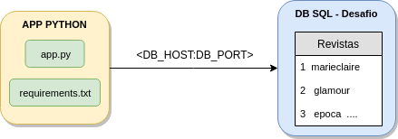
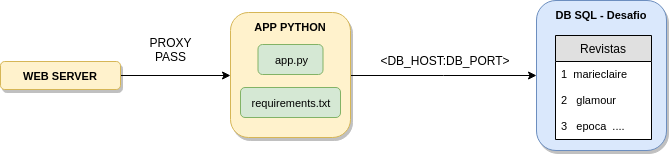

# Desafio

## Quer trabalhar em nosso time de Devops?

Esse é o nosso desafio para você! O objetivo é avaliar o seu conhecimento e habilidades em infraestrutura.

## Desafio

O desafio é composto por duas partes. 


## Parte 1 - Subir um app Python e conectar com o banco de dados

Na pasta app temos os seguintes arquivos: 

+ **init.sql** - Cria o banco *desafio*, a tabela *revistas*  e insere algumas linhas
+ **app.py** - Aplicação que bate no banco *desafio* e faz a query
+ **requirements** - Dependências do projeto Python


O desafio é subir o app Python, faze-lo se conectar ao banco e retornar o resultado da query.

O foco desta etapa é subir o ambiente corretamente, não é necessário alterar o código do app.

Ao final desta etapa, esta seria o desenho do ambiente: 




Os passos são estes: 

+ Criar um Banco SQL 
+ Popular os dados no banco (init.sql)
+ Conectar o app ao banco de dados 
+ Subir a aplicação


### Variáveis

Para o app são esperadas 4 variáveis de ambiente. Caso você não as preencha serão utilizados valores default, fica ao seu critério:

+ `DB_USER - default:root`
+ `DB_PASS - default:root`
+ `DB_HOST - default:localhost` 
+ `DB_PORT - default:3306`


&nbsp;

### Testando
 
Com a aplicação no ar, esperamos os resultados: 

+ Batendo na rota padrão (/)

```
[{"id": 1, "message": "marieclaire"}, {"id": 2, "message": "glamour"}, {"id": 3, "message": "epoca"}, {"id": 4, "message": "extra"}, {"id": 5, "message": "globo"}, {"id": 6, "message": "valor"}, {"id": 7, "message": "autoesporte"}, {"id": 8, "message": "pegn"}]
```

+ Batendo na rota /time, exibe a hora atual

```
2019-05-29 17:41:46.583091
```

&nbsp;


## Parte 2 - Criando um servidor Web

Crie um servidor Web que faça um proxy pass das requisições para o servidor de aplicação criado anteriormente.

Ao final desta etapa este será a estrutura: 





## Plus

 + Utilizar docker/docker-compose
 + Implantar algum tipo de cache nas requisições (seja no Web Server ou no App) 
 
&nbsp;

 
## O que será avaliado 

+ Se as soluções propostas funcionam
+ Se o app conecta e exibe as informações do banco 
+ Simplicidade > Complexidade  =)
+ Se algum dos itens **plus** foi implementado

&nbsp;
 
 
## Enviando a solução
 
Quando concluir o desafio, siga estes passos para nos enviar a solução:

 * Faça um clone deste repoistório
    * `git clone https://github.com/Infoglobo/desafio-devops-eg.git`

 * Faça o commit da sua solução:
    * `git commit -am "< sua solução/comentários >"`

 * Crie um patch file:
   * `git format-patch origin/master --stdout > devops.patch`

 * Mande o arquivo *devops.patch* para **aalbalustro@edglobo.com.br**
 
&nbsp;
**$** echo "boa sorte" 
